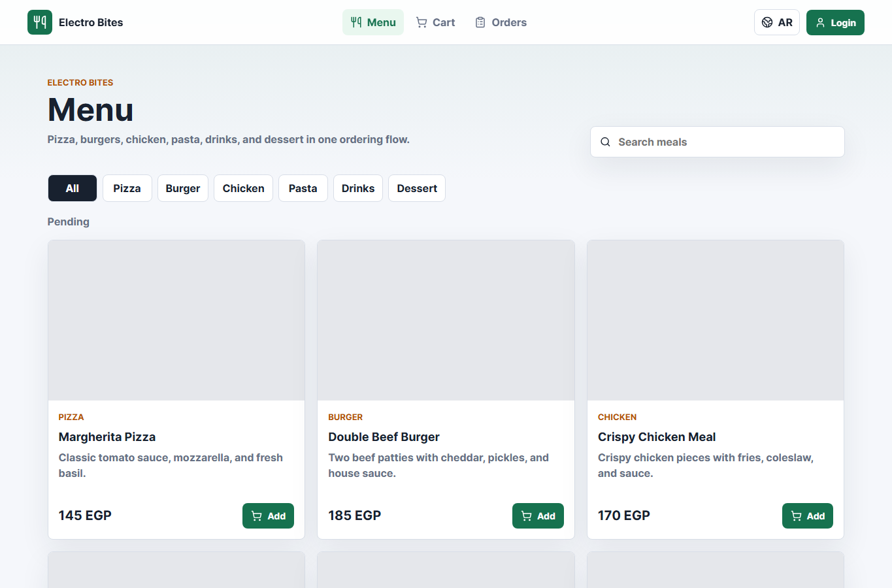
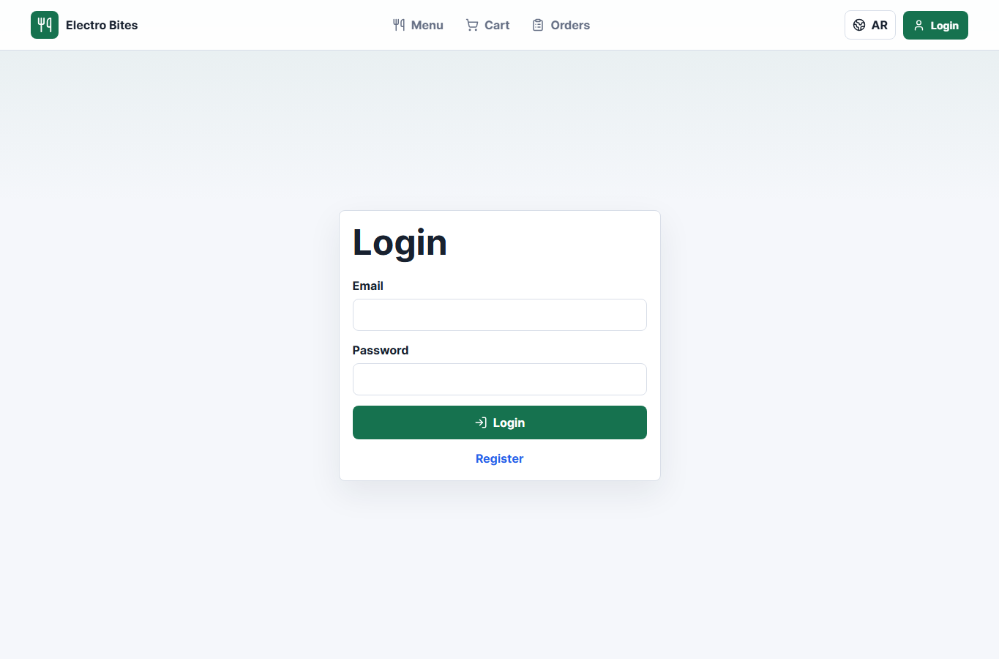

# Online Food Ordering Web Application

Full-stack prototype for an online food ordering application, built as a hiring task for Electro Pi.

## Features

- Complete food menu with images, prices, categories, and search.
- Add items to cart, update quantity, remove items, and clear cart.
- Place orders from cart.
- Payment options: Online Payment and Cash on Delivery.
- Order status tracking: Placed, Preparing, On the way, Delivered, Cancelled.
- User authentication with JWT.
- Admin dashboard for stats, products, and orders.
- Admin product CRUD.
- Admin order monitoring and status update.
- Multi-language interface: Arabic and English.
- Responsive UI for desktop and mobile.

## Tech Stack

Backend:

- Node.js
- Express.js
- MongoDB / Mongoose
- JWT
- bcryptjs
- Joi

Frontend:

- React
- Vite
- React Router
- Context API
- lucide-react icons

## Project Structure

```txt
.
  DB/
    connection.js
    models/
  src/
    middleware/
    modules/
      admin/
      auth/
      cart/
      order/
      product/
    utils/
      seedData.js
  frontend/
    src/
      api/
      components/
      context/
      data/
      i18n/
      pages/
```

## Backend Setup

Create `.env` in the root folder using `.env.example`:

```env
PORT=5000
MONGO_URI=mongodb://127.0.0.1:27017/online-food-ordering
JWT_SECRET=online_food_ordering_secret
SALT_ROUND=8
CLIENT_URLS=http://localhost:5173,http://127.0.0.1:5173,http://localhost:5174,http://127.0.0.1:5174
BEARER_KEY=Bearer
```

Install dependencies:

```bash
npm install
```

Seed admin user and demo menu:

```bash
npm run seed
```

Run backend:

```bash
npm run dev
```

Backend base URL:

```txt
http://localhost:5000
```

## Frontend Setup

Create `frontend/.env` using `frontend/.env.example`:

```env
VITE_API_BASE_URL=http://localhost:5000
```

Install dependencies:

```bash
cd frontend
npm install
```

Run frontend:

```bash
npm run dev
```

Build frontend:

```bash
npm run build
```

## Admin Credentials

```txt
Email: admin@foodapp.com
Password: Admin123456
```

The seed command creates or updates this admin account.

## Main API Endpoints

Auth:

```txt
POST /auth/register
POST /auth/login
GET  /auth/me
```

Menu:

```txt
GET /product
GET /product/:id
```

Cart:

```txt
GET    /cart
POST   /cart
PATCH  /cart/:productId
DELETE /cart/:productId
DELETE /cart
```

Orders:

```txt
POST  /order
GET   /order/my-orders
GET   /order/:id
PATCH /order/:id/cancel
```

Admin:

```txt
GET    /admin/stats
GET    /admin/products
POST   /admin/products
GET    /admin/products/:id
PATCH  /admin/products/:id
DELETE /admin/products/:id
GET    /admin/orders
GET    /admin/orders/:id
PATCH  /admin/orders/:id/status
```

## Screenshots

Menu:



Login:



## Prototype Notes

- Online payment is implemented as a prototype flow. When the user chooses Online Payment, the order is saved with `paymentStatus: "paid"`.
- Cash on Delivery orders are saved with `paymentStatus: "pending"`.
- The frontend includes fallback demo data so the UI remains viewable even if the backend is not running.
- Product names and descriptions are stored in both Arabic and English.
